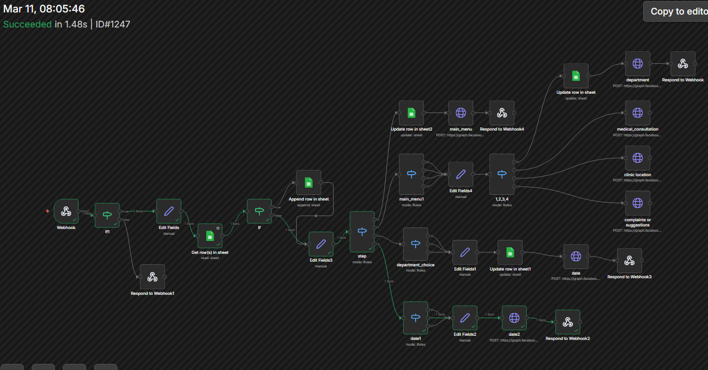
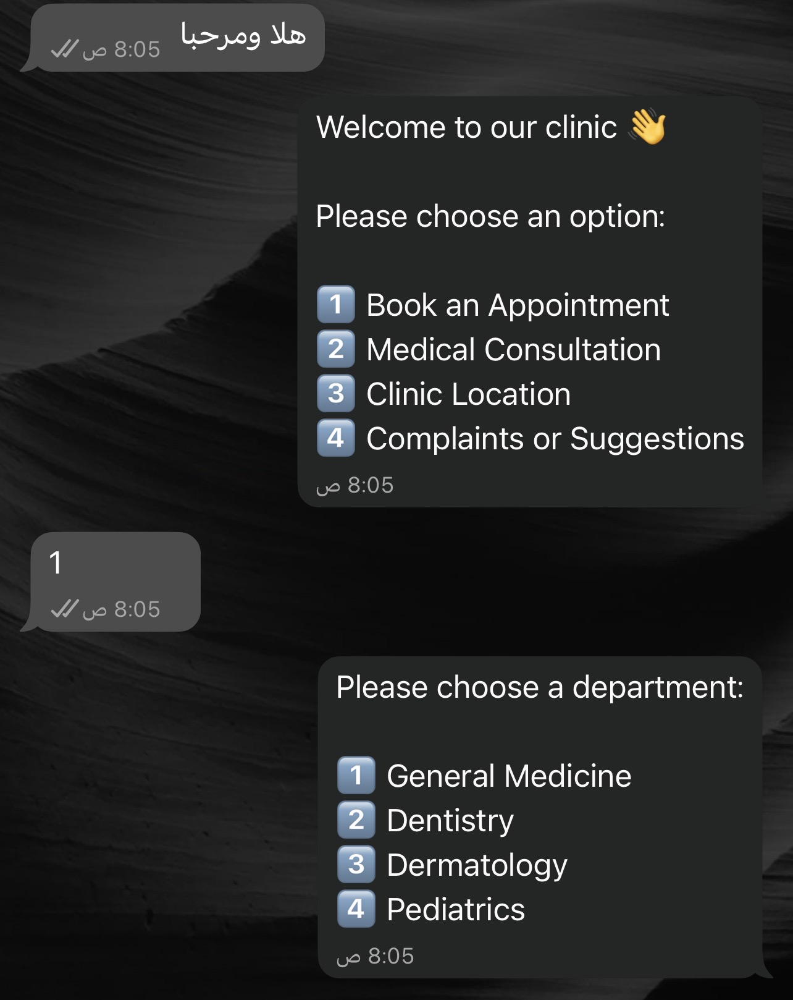
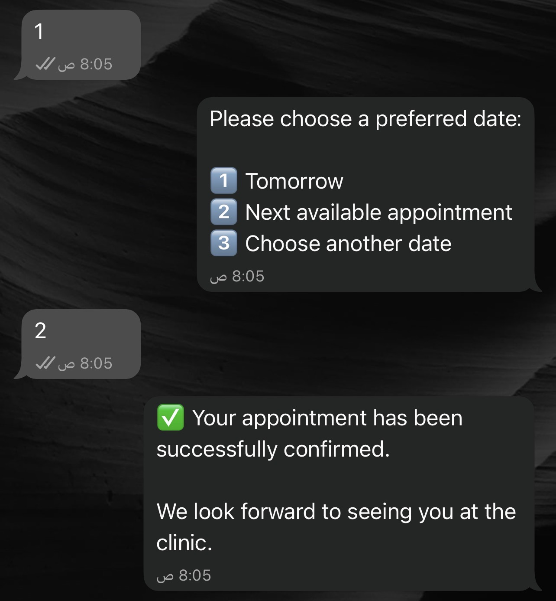
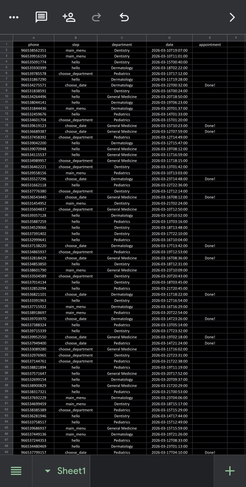

# WhatsApp-healthcare-booking-automation
Automated WhatsApp chatbot for healthcare appointment booking built with n8n. The system collects patient booking data in Google Sheets which can later be used for healthcare data analysis and reporting.

This project demonstrates an automated healthcare appointment booking system using WhatsApp and n8n.

The chatbot guides patients through a simple booking flow:

• Start conversation  
• Choose a department  
• Select a preferred appointment date  
• Receive appointment confirmation  

All booking data is automatically stored in Google Sheets creating a structured dataset that can later be used for healthcare data analysis and reporting.

---
## Project Impact

This system automates the clinic appointment booking process using WhatsApp.

Benefits:

• Reduces manual booking workload  
• Enables patients to schedule appointments instantly  
• Generates structured data for healthcare analytics  
• Supports future dashboard development using BI tools

---

## System Architecture

User → WhatsApp API → n8n Workflow → Google Sheets

---

## Workflow Architecture

---

## Chatbot Interaction

---

## Dataset Example

The system automatically logs booking data including:

• phone number  
• selected department  
• appointment date  
• booking status  

This dataset can later be connected to tools such as Power BI for healthcare analytics.

---

## Technologies Used

- n8n
- WhatsApp Business API

---

## Data Analysis Potential

The dataset generated by this system can be used to analyze:

• Most requested medical departments
• Appointment booking trends
• Peak booking hours
• Patient interaction flow

- Google Sheets
- Automation Workflows
